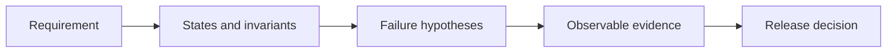

<div align="center">

# HUNG THINH

### Quality Engineer focused on system behavior, data integrity, and failure analysis

`I do not test whether software looks finished.`
`I test whether its confidence is deserved.`

[Portfolio](https://github.com/hungthinh1104/Porforlio_QA_QC) ·
[GitHub](https://github.com/hungthinh1104) ·
[Email](mailto:re.peke.pbe@gmail.com)

</div>

---

## GREEN IS A CLAIM

A passing build, a clean dashboard, or a completed test run is only an output.

The real quality questions are:

```text
What was verified?
What was assumed?
What can fail?
What evidence supports the release decision?
```

My work is organized around four signals:

<table>
<tr>
<td width="25%" valign="top">

### CLARIFY

Find missing rules, conflicting interpretations, and unsupported assumptions.

</td>
<td width="25%" valign="top">

### VERIFY

Trace state and data back to an explicit source of truth.

</td>
<td width="25%" valign="top">

### STRESS

Attack retries, concurrency, partial failure, and dependency boundaries.

</td>
<td width="25%" valign="top">

### DECIDE

Release only when the available evidence matches the actual risk.

</td>
</tr>
</table>



---

## SELECTED WORK

<table>
<tr>
<td width="50%" valign="top">

### [BA Helper](https://github.com/hungthinh1104/BA_Helper)

**Can requirement impact be traced without hiding uncertainty?**

An evidence-backed requirement-to-code impact analyzer for backend teams.

**Quality focus**

* source-linked impact analysis
* explicit unknowns and risks
* mandatory human review
* immutable reviewed snapshots
* deterministic reports

`CLARIFY · TRACEABILITY · HUMAN GATE`

</td>
<td width="50%" valign="top">

### [vuarau-ops](https://github.com/hungthinh1104/vuarau-ops)

**Can financial data remain trustworthy after retries and corrections?**

An operational ledger for wholesale vegetable depots in Vietnam.

**Quality focus**

* append-only debt ledger
* compensating records
* idempotent commands
* dual transaction timestamps
* PostgreSQL integration tests
* rule-to-code traceability

`VERIFY · INVARIANT · IDEMPOTENCY`

</td>
</tr>

<tr>
<td width="50%" valign="top">

### [Rental Room](https://github.com/hungthinh1104/RentalRoom)

**What degrades first when a full-stack system is under pressure?**

A property-management platform with payments, contracts, notifications, search, and external dependencies.

**Quality focus**

* API behavior
* authorization paths
* payment state transitions
* dependency failures
* monitoring and degradation analysis

`STRESS · DEPENDENCIES · OBSERVABILITY`

</td>
<td width="50%" valign="top">

### [EduKids](https://github.com/hungthinh1104/EduKids)

**What evidence should block or permit a release?**

A learning platform with frontend, backend, PostgreSQL, Redis, queues, and observability.

**Quality focus**

* frontend and backend regression tests
* migration-risk reasoning
* CI quality gates
* health and metrics endpoints
* Prometheus and Grafana

`DECIDE · RELEASE GATE · MIGRATION RISK`

</td>
</tr>
</table>

---

## FAILURE MODES I LOOK FOR

```text
[ ] invalid state transitions
[ ] duplicate or out-of-order operations
[ ] stale reads and inconsistent projections
[ ] retries without idempotency
[ ] partial success across dependencies
[ ] authorization gaps
[ ] silent fallback behavior
[ ] unobservable failures
[ ] green tests that asserted the wrong thing
[ ] requirements that cannot be tested consistently
```

---

## QUALITY TOOLBOX

| Area                | Focus                                                     |
| ------------------- | --------------------------------------------------------- |
| Test design         | exploratory, scenario-based, state-transition, risk-based |
| API                 | Postman, contracts, validation, error semantics           |
| Data                | SQL, PostgreSQL, reconciliation, invariants               |
| Automation          | Vitest, Playwright, integration tests                     |
| Reliability         | retries, idempotency, queues, dependency failure          |
| Observability       | logs, metrics, Prometheus, Grafana                        |
| Engineering context | TypeScript, NestJS, Next.js, Docker, GitHub Actions       |

Development is supporting context.

The primary question remains:

> Does the system behave correctly, fail safely, and leave enough evidence to explain what happened?

---

## CURRENT DIRECTION

```yaml
target_role: QA/QC Intern
trajectory: System-level Quality Engineer
developing:
  - production-oriented API testing
  - test automation
  - reliability and performance analysis
  - English communication for global QA teams
```

---

<div align="center">

### EVIDENCE MAKES IT CONFIDENCE

[Open the portfolio](https://github.com/hungthinh1104/Porforlio_QA_QC)

</div>
